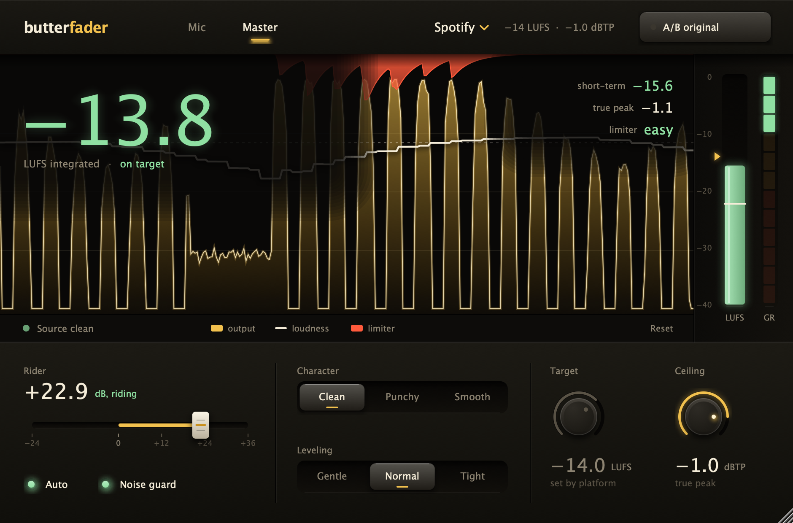
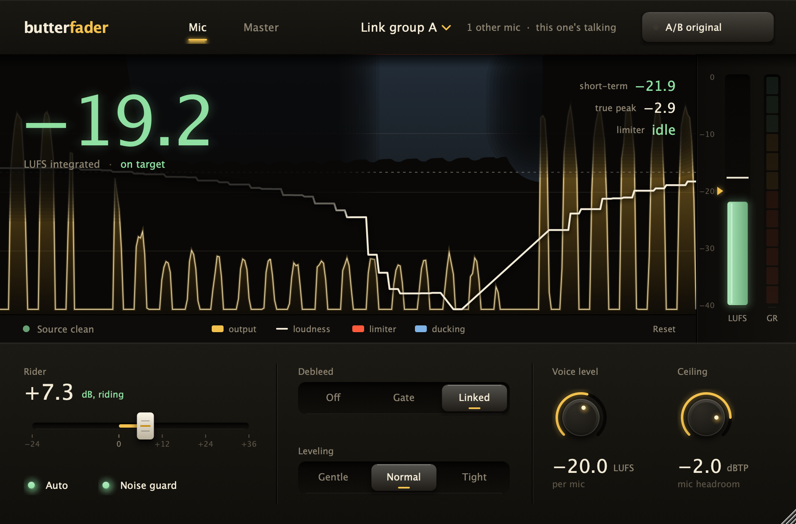

# Butterfader

A loudness plug-in for Premiere Pro, Audition and any VST3/AU host. Put one on each mic to level voices and duck bleed, and one on the master to hit a platform's loudness target with a true-peak limiter on the end.



## Two modes

**Mic** goes on each voice track. It levels the voice to an even speech level (about -20 LUFS) with a -2 dBTP safety ceiling, and removes bleed from other mics.

**Master** goes on the Mix track. It takes the whole programme to a platform target.



## What it does

| | |
|---|---|
| **Debleed (Mic)** | *Linked*: every Butterfader in Mic mode in the same link group shares who's talking, with no routing, and turns down the mics that aren't talking (like an auto-mixer). *Gate*: ducks quiet bleed using this mic's own level, and is used automatically when a linked mic has no partners. *Off*. |
| **Link group (Mic)** | A to D. Mics only duck others in the same group, so separate shows or scenes don't interfere. |
| **Noise guard** | Tracks the background hiss and hum. The rider never learns levels from noise or bleed, and between phrases the noise is pushed back down to at least the level it came in at. |
| **Deliver to (Master)** | Spotify, Apple Music, YouTube, Amazon, Tidal, Deezer, SoundCloud, Instagram/TikTok, Podcast, Audiobook (ACX), EBU R128, ATSC A/85 or Custom. Sets the loudness target and caps the ceiling at the platform's limit. |
| **Rider (Auto)** | Learns how loud the source is while it plays and moves the gain toward the target, up to +36 dB for quiet recordings. It holds still through pauses, so room tone isn't pumped up. Switch to Manual to set the gain yourself. |
| **True-peak limiter** | Look-ahead, stereo-linked, 8x true-peak detection. The ceiling defaults to -1 dBTP. Character: Clean, Punchy (fast release) or Smooth (slow release). Release slows automatically under sustained limiting. |
| **Display** | The last few seconds of output, with limiter reduction in red from the top, ducking in blue and the short-term loudness line. The big number is integrated LUFS, coloured green on target, amber a bit hot, red too loud, blue quiet. |
| **Meters** | LUFS column (short-term fill, momentary tick, target notch; measured to ITU-R BS.1770 / EBU R128) and GR segments showing how hard the limiter works: green under 3 dB, amber 3 to 6, red over 6. |
| **Integrated / true peak** | Gated integrated LUFS and max true peak since the last Reset. |
| **Source clipping** | Watches the audio before any processing and counts flat-topped or over-0 dBFS clipping already in the recording. Click the badge to clear it. |
| **A/B Compare** | Plays the original, delayed and gain-matched to the processed loudness, so you hear the processing rather than the volume change. It's also the host bypass. |

Leveling sets how quickly the rider reacts: Gentle, Normal or Tight.

Latency is about 2.3 ms, reported to the host. The window scales from 60% to 200% (drag the corner).

## Tips for Premiere Pro

- Put a **Mic** instance on each voice track, and a **Master** instance on the **Mix** track, then export.
- Linked debleed relies on the host running all the instances together, which Premiere and Audition do on playback and export. If linking ever doesn't kick in, the header says "No other mics linked yet" and Gate is used instead.
- The rider learns while audio plays, so the first second or so after a cold start is where it locks on.
- Mono tracks are measured as dual-mono, which is how they play back on two speakers.

## Install

Download **Butterfader.dmg** from the [latest release](../../releases/latest). Every push to `main` builds one automatically. Open it and double-click **Install Butterfader.pkg**, then:

- **Premiere Pro:** Settings > Audio > Audio Plug-in Manager > Scan for Plug-ins
- **Audition:** Effects > Audio Plug-in Manager > Scan for Plug-ins

The installer isn't notarised. If macOS blocks it, right-click > Open.

## Build

Requires Xcode and CMake. JUCE 8 is fetched automatically.

```bash
cmake -B build -DCMAKE_BUILD_TYPE=Release
cmake --build build --target Butterfader_VST3 Butterfader_AU   # also copies into ~/Library/Audio/Plug-Ins
```

Checks:

```bash
cmake --build build --target DSPTest && ./build/DSPTest_artefacts/Release/DSPTest        # loudness, true peak, auto level, bypass match, clip detection, noise guard, debleed
cmake --build build --target UISnapshot && ./build/UISnapshot_artefacts/Release/UISnapshot /tmp   # renders the UI to PNGs
./scripts/make-dmg.sh                                                                    # universal installer DMG
```

Source layout: `Source/DSP/Loudness.h` (BS.1770 meter), `Source/DSP/TruePeakLimiter.h`, `Source/DSP/Rider.h`, `Source/DSP/MicLink.h` (debleed link + noise floor), `Source/Platforms.h` (targets), `Source/UI/`.
